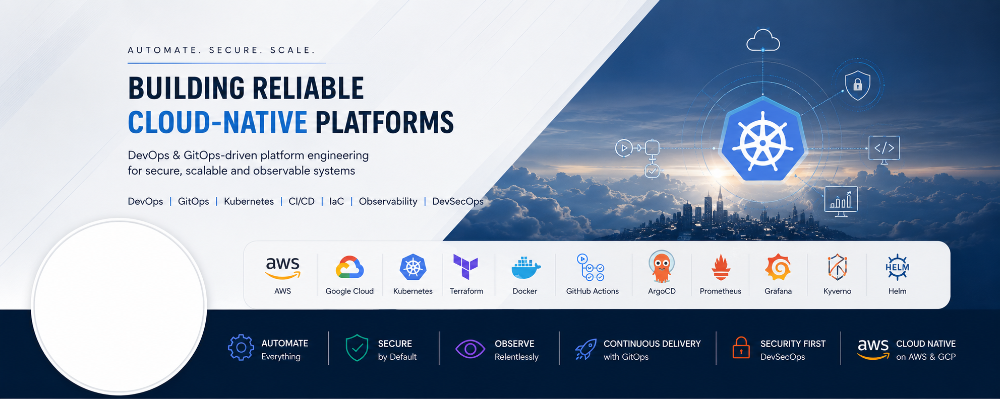

  

# Naveen

### DevOps Engineer · Platform Engineer · Cloud Engineer

---

## About

DevOps Engineer with 5+ years of IT experience, including 4+ years specializing in AWS, Kubernetes (Amazon EKS), and Platform Engineering. I design and build production-grade cloud-native platforms — combining Infrastructure as Code, GitOps, CI/CD, and DevSecOps to deliver software that's scalable, secure, and observable by default.

**AWS Certified Solutions Architect – Associate (SAA-C03)**

---

## Current Focus

- ☁️ AWS & Google Cloud Platform
- ☸️ Kubernetes administration and platform engineering
- 🔄 GitOps delivery with Argo CD
- 🔐 DevSecOps and software supply chain security
- 📊 Observability and production reliability

---

## Tech Stack

---

## Featured Projects

| Project | Description |
|---|---|
| ⚙️ [**platform-engineering-portfolio**](https://github.com/stackcouture/platform-engineering-portfolio) | Production-inspired cloud-native platform on Google Kubernetes Engine (GKE) — GitOps delivery, Argo Rollouts, Vault, Kyverno, Falco, and full observability stack |
| ☁️ [**devsecops-gitops-automation**](https://github.com/stackcouture/devsecops-gitops-automation) | DevSecOps platform on AWS using Terraform and Argo CD, with Jenkins + GitHub Actions CI/CD pipelines to Amazon EKS |
| 🧩 [**terraform-eks-modules**](https://github.com/stackcouture/terraform-eks-modules) | Reusable Terraform modules for provisioning secure, scalable EKS clusters on AWS |
| 🐳 [**aws-ecs-proj**](https://github.com/stackcouture/aws-ecs-proj) | Website deployed on AWS ECS with a complete CI/CD pipeline built using Jenkins and Terraform |
| 🏗️ [**terraform-projects-portfolio**](https://github.com/stackcouture/terraform-projects-portfolio) | IAM, S3-hosted static website, and EBS volume management provisioned through Terraform |

---

## Connect

<a href="https://stackcouture.online">Portfolio</a> ·
<a href="https://linkedin.com/in/naveen-stackcouture">LinkedIn</a> ·
<a href="https://github.com/stackcouture">GitHub</a> ·
<a href="https://stackcouture.medium.com">Medium</a>

---

### Automate everything · Secure by default · Observe relentlessly

