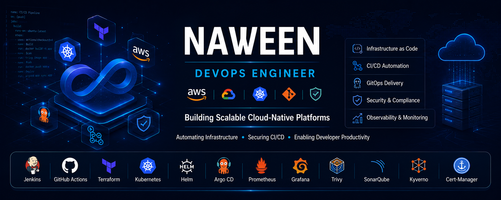

  

---

## 👨‍💻 About Me

🚀 **DevOps Engineer** with **5+ years of IT experience**, including **4+ years specializing in AWS, Kubernetes, and Platform Engineering**. Experienced in designing and building **production-grade cloud-native platforms** using **Infrastructure as Code (Terraform)**, **GitOps**, **CI/CD**, and **DevSecOps** practices to deliver **scalable, secure, reliable, and observable** systems.

☁️ Skilled in automating **cloud infrastructure provisioning**, implementing Kubernetes-based application delivery across **Amazon EKS** and **Google Kubernetes Engine (GKE)**, building **CI/CD and GitOps workflows**, enforcing **security controls**, and enabling **end-to-end monitoring and observability** for modern cloud-native environments.

📚 Continuously expanding expertise in **Google Cloud Platform (GCP)**, **Google Kubernetes Engine (GKE)**, **Platform Engineering**, and **DevSecOps** through hands-on projects focused on **Terraform-based infrastructure provisioning**, **GitOps with Argo CD**, **Kubernetes workload management**, **policy enforcement**, **progressive delivery**, **monitoring**, and **cloud-native automation**.

<!-- 
## About

DevOps Engineer with 5+ years of IT experience, including 4+ years specializing in AWS, Kubernetes (Amazon EKS), and Platform Engineering. I design and build production-grade cloud-native platforms — combining Infrastructure as Code, GitOps, CI/CD, and DevSecOps to deliver software that's scalable, secure, and observable by default.

Since November 2024 I've been on a planned career break for family responsibilities, using the time to deepen my platform engineering skills, earn a new certification, and ship hands-on projects — all documented on this profile.

**AWS Certified Solutions Architect – Associate (SAA-C03)** -->

---

## Current Focus

- ☁️ AWS & Google Cloud Platform
- ☸️ Kubernetes administration and platform engineering
- 🔄 GitOps delivery with Argo CD
- 🔐 DevSecOps and software supply chain security
- 📊 Observability and production reliability

---

## Tech Stack

---

## GitHub Stats

  
  

  

  

---

## Featured Projects

| Project | Description |
|---|---|
| ⚙️ [**platform-engineering-portfolio**](https://github.com/stackcouture/platform-engineering-portfolio) | Production-inspired cloud-native platform on Google Kubernetes Engine (GKE) — GitOps delivery, Argo Rollouts, Vault, Kyverno, Falco, and full observability stack |
| ☁️ [**devsecops-gitops-automation**](https://github.com/stackcouture/devsecops-gitops-automation) | DevSecOps platform on AWS using Terraform and Argo CD, with Jenkins + GitHub Actions CI/CD pipelines to Amazon EKS |
| 🧩 [**terraform-eks-modules**](https://github.com/stackcouture/terraform-eks-modules) | Reusable Terraform modules for provisioning secure, scalable EKS clusters on AWS |
| 🐳 [**aws-ecs-proj**](https://github.com/stackcouture/aws-ecs-proj) | Website deployed on AWS ECS with a complete CI/CD pipeline built using Jenkins and Terraform |
| 🏗️ [**terraform-projects-portfolio**](https://github.com/stackcouture/terraform-projects-portfolio) | IAM, S3-hosted static website, and EBS volume management provisioned through Terraform |

---

## Certifications

---

## Connect

<em>Open to DevOps / Platform Engineer roles — let's talk infrastructure, automation, or your next production incident 🔥</em>

---

### Automate everything · Secure by default · Observe relentlessly

