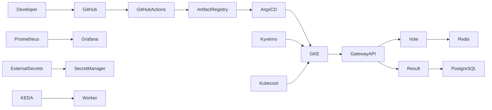

# 👋 Hi, I'm Naveen

### ☁️ DevOps Engineer • Platform Engineer • Cloud Engineer

---

# 💡 Engineering Philosophy

> **Build platforms, not pipelines.**

- ✅ Infrastructure as Code
- ✅ GitOps over Manual Operations
- ✅ Secure by Default
- ✅ Automation First
- ✅ Observable Systems
- ✅ Reproducible Infrastructure
- ✅ Developer Experience Matters

---

# 🚀 What I Build

<table>
<tr>
<td width="50%">

### ☁️ Cloud Platforms

- Google Cloud Platform
- Amazon Web Services
- Kubernetes Platforms
- Platform Engineering

</td>

<td width="50%">

### ⚙️ Automation

- Infrastructure as Code
- GitOps
- CI/CD Pipelines
- DevSecOps

</td>
</tr>
</table>

---

# 🏗 Production-Grade Platform Engineering

## GitOps Platform on Google Kubernetes Engine

A production-inspired cloud-native platform demonstrating modern Platform Engineering practices.

### 🚀 Platform Features

- ☁️ Private Google Kubernetes Engine
- 🏗 Modular Terraform Infrastructure
- 🚀 GitHub Actions CI
- 🔄 ArgoCD GitOps Delivery
- 📦 Helm & Kustomize
- 🌐 Gateway API + NGINX Gateway Fabric
- 🚦 Argo Rollouts Progressive Delivery
- 📈 Prometheus Monitoring
- 📊 Grafana Dashboards
- 🚨 Alertmanager
- 💰 Kubecost
- ⚡ KEDA Autoscaling
- 🔐 Kyverno Policy Enforcement
- 🔎 Trivy Security Scanning
- 📄 SBOM Generation
- ✍️ Cosign Image Signing
- 🔑 External Secrets Operator
- 🔒 Google Secret Manager
- 🌍 Cloudflare DNS Automation
- 📜 Cert Manager TLS Automation

---

# 🏛 Platform Architecture

---

# 🛠 Technology Stack

### ☁️ Cloud

### ☸ Containers & Orchestration

Helm • ArgoCD • Kustomize • Gateway API

---

### ⚙ Infrastructure as Code

---

### 🚀 CI/CD

ArgoCD • GitOps

---

### 🔐 DevSecOps

- Kyverno
- Trivy
- Cosign
- SBOM
- SonarQube
- Snyk
- External Secrets

---

### 📈 Observability

- Prometheus
- Grafana
- Alertmanager
- Kubecost

---

### 💻 Languages

---

# ⭐ Featured Repositories

## 🚀 Production GitOps Platform

Production-ready cloud-native platform demonstrating Platform Engineering best practices.

**Repository**

https://github.com/stackcouture/voting-app

---

## ☁️ Platform Infrastructure

Reusable Terraform modules provisioning

- VPC
- Private GKE
- IAM
- Artifact Registry
- Cloud Storage
- Workload Identity

**Repository**

https://github.com/stackcouture/platform-infra

---

## 🚀 GitOps Repository

GitOps deployment repository

- ArgoCD
- Kustomize
- Helm
- Progressive Delivery

**Repository**

https://github.com/stackcouture/gitops-microservices-platform

---

# 📈 GitHub Analytics

---

# 📊 Contribution Graph

---

# 📜 Certifications

- 🏅 AWS Certified Solutions Architect – Associate
- 🎯 Certified Kubernetes Administrator (In Progress)

---

# 🌐 Connect With Me

---

## ⭐ Thanks for visiting my profile!

### **Automate Everything • Secure by Default • Observe Relentlessly**

*"Turning cloud infrastructure into reliable, scalable, and production-ready platforms."*

