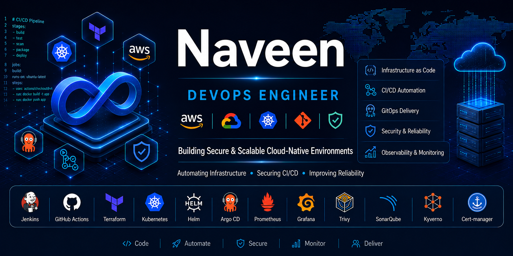

  

---
## 👨‍💻 About Me

🚀 DevOps Engineer with **5+ years** of IT experience, hands-on epxerience in **AWS, Kubernetes, and Cloud Infrastructure**. Experienced in designing, automating, and managing production-grade **cloud-native environments** using **Infrastructure as Code (Terraform), GitOps, CI/CD, and DevSecOps** practices to build scalable, secure, reliable, and observable systems.

☁️ Skilled in automating cloud infrastructure provisioning, deploying and managing Kubernetes workloads across **Amazon EKS** and **Google Kubernetes Engine (GKE)**, building **CI/CD** and **GitOps workflows**, implementing **infrastructure automation, enforcing security best practices,** and enabling end-to-end monitoring and observability for modern cloud-native applications.

📚 Continuously expanding expertise in **Google Cloud Platform (GCP), Google Kubernetes Engine (GKE), Terraform, Kubernetes, GitOps, CI/CD,** and **DevSecOps** through hands-on projects focused on infrastructure provisioning, Kubernetes operations, policy enforcement, progressive delivery, monitoring, cloud security, and automation.

---
## 🎯 Current Focus

* Production-grade Kubernetes on Google Kubernetes Engine (GKE)
* GitOps with Argo CD and Kustomize
* Software Supply Chain Security (Cosign, SBOM, Trivy)
* Kubernetes Policy Enforcement with Kyverno
* Platform Observability using Prometheus and Grafana

---

---
## Tech Stack

---
## 🚀 Featured Projects

| Project | Description |
|---|---|
| [**cloud-native-gke**](https://github.com/stackcouture/cloud-native-gke) | Built a production-inspired Kubernetes environment on Google Kubernetes Engine featuring Terraform, GitOps, Argo Rollouts, Kyverno, Falco, Vault, KEDA, Gateway API, and complete observability. |
| [**devsecops-gitops-automation**](https://github.com/stackcouture/devsecops-gitops-automation) | Provisioned a production-ready Amazon EKS platform using Terraform with automated CI/CD, GitOps, security scanning, and infrastructure automation. |
| [**eks-node-autoscaling**](https://github.com/stackcouture/eks-node-autoscaling) | Production-ready Amazon EKS node autoscaling using Karpenter and Cluster Autoscaler with IRSA, EC2NodeClass, NodePool, and Spot/On-Demand capacity. |
| [**aws-ecs-proj**](https://github.com/stackcouture/aws-ecs-proj) | Website deployment on Amazon ECS with a complete CI/CD pipeline using Jenkins and Terraform. |

---
## GitHub Stats

  
  

<!-- 

  

 -->

<!-- 

  

 -->

---
## 🏆 Certifications

  

  <em>Passionate about continuous learning and strengthening expertise through hands-on projects, industry-recognized cloud certifications, and emerging DevOps technologies.</em>

---
## 🤝 Let's Connect

Thank you for visiting my GitHub profile!

I'm passionate about building **secure**, **scalable**, and **production-ready** cloud-native infrastructure, and I enjoy connecting with engineers, recruiters, and technology enthusiasts who share an interest in **DevOps**, **Cloud Infrastructure**, **Kubernetes**, and **DevSecOps**.

If you're hiring for **DevOps Engineer**, **Cloud Engineer**, or **Site Reliability Engineer (SRE)** roles, interested in collaborating on open-source projects, or would like to discuss **Kubernetes**, **GitOps**, **Infrastructure as Code (Terraform)**, **CI/CD**, **Cloud Platforms (AWS & Google Cloud Platform)**, **DevSecOps**, or **Cloud Automation**, I'd be delighted to connect.

I'm always eager to contribute to engineering teams by automating infrastructure, improving deployment workflows, strengthening cloud security, and building reliable, scalable, and observable cloud-native environments.

  
  
  
  
  

  <strong>⭐ If you find my projects valuable, consider giving them a star.</strong> 
  Your support encourages me to continue building and sharing production-inspired DevOps, Kubernetes, GitOps, and Platform Engineering projects with the community.

---

### Automate everything · Secure by default · Observe relentlessly

